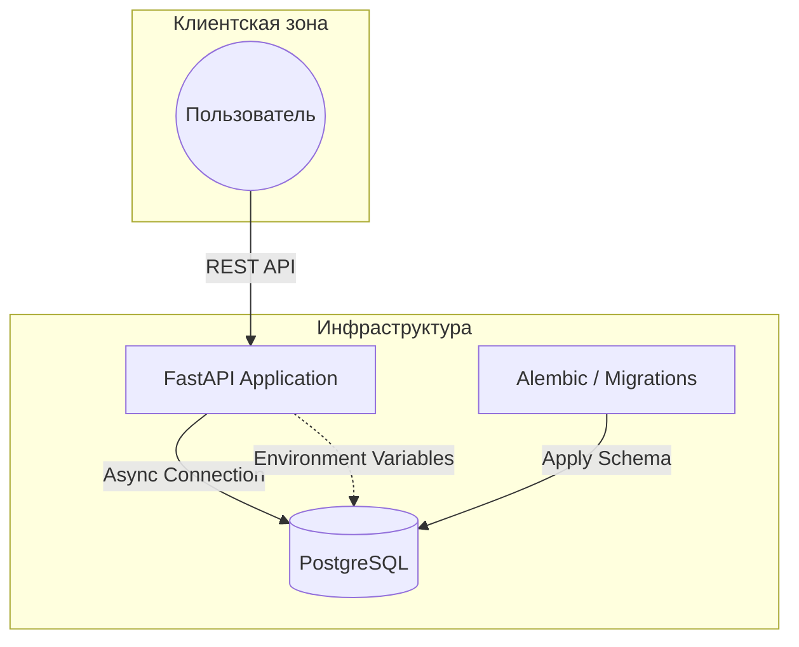

# logistics-backend-task: Система управления заказами и номенклатурой

Решение тестового задания, включающее проектирование реляционной схемы БД, разработку SQL-аналитики и создание REST-сервиса на стеке FastAPI.

## 📋 Выполнение требований ТЗ

Проект покрывает пункты задания:
1. **Спроектирована схема БД** с поддержкой неограниченной вложенности категорий.
2. **Реализованы аналитические SQL-запросы** (сумма по клиентам, дерево категорий, ТОП-5 товаров).
3. **Разработан REST-сервис** «Добавление товара в заказ» с обработкой бизнес-логики и защитой от race conditions.

---

## 🌟 Технологические особенности

*   **Асинхронность:** Полный цикл работы (API -> ORM -> DB) реализован на `asyncio`.
*   **Надежность:** Использование `SELECT FOR UPDATE` гарантирует консистентность остатков товара при конкурентных запросах.
*   **Тестирование:** Unit и Integration тесты с покрытием >90% и автоматическим прогоном в CI.
*   **Infrastructure as Code:** Управление окружением через `Docker Compose`, `Makefile` и `entrypoint` скрипты.
*   **Качество кода:** Строгая типизация `mypy` и линтинг `ruff`.

---

## Архитектура системы


---

## 🗄️ Схема данных (Пункт 1)

Модель данных построена по реляционному принципу:
*   **Иерархия категорий:** Реализована через `parent_id` (Adjacency List), что позволяет создавать дерево неограниченной вложенности.
*   **Заказы:** Реализованы через связь Many-to-Many между `Order` и `Nomenclature` с хранением цены на момент покупки в `OrderItem`.

**Диаграмма БД:**


---

## 📊 SQL Аналитика (Пункт 2)

В рамках задания реализованы аналитические запросы для получения бизнес-метрик. 
Полный код с комментариями доступен в файле **[solution.sql](./docs/solution.sql)**.

### Основные отчеты:
*   **Сумма по клиентам:** Расчет LTV (Lifetime Value) каждого клиента на основе истории заказов.
*   **Дерево категорий:** Анализ вложенности каталога (подсчет дочерних элементов 1-го уровня).
*   **ТОП-5 Продаж:** View для мониторинга популярных товаров за последние 30 дней с автоматическим определением родительской категории 1-го уровня через рекурсивные запросы (CTE).

> **Оптимизация:** Для обеспечения производительности при нагрузке в тысячи заказов в день предложено внедрение индексов на поля дат, партиционирование таблиц и использование Materialized Views для тяжелых отчетов.

---

## 🚀 Быстрый старт

### 1. Запуск приложения (Prod-ready)
Система автоматически применит миграции и запустит Gunicorn:
```bash
    cp .env.template .env
    docker compose up --build
```
Документация API: http://localhost:8000/docs

2. Запуск тестов и проверки качества
Включает в себя создание тестовой БД, миграции, сидинг данных и отчет о покрытии:
```bash
  make test
```

3. Наполнение основной БД (Seed)
Для загрузки демонстрационных данных (клиенты, категории, товары) используется debug профиль:
```bash
  docker compose --profile debug run db_seeder
```

---

## ✅ CI/CD Пайплайн
В проекте настроен GitHub Actions, который при каждом PR:
* Проверяет стиль кода (ruff).
* Проверяет типизацию (mypy).
* Запускает тесты в Docker-окружении.
* Блокирует Merge, если покрытие кода (coverage) составляет менее 80%.


## Автор: 

- **Максим Губенин**
- **telegram**: @SKDM25
- **mail**: maksimgubenin@mail.ru
